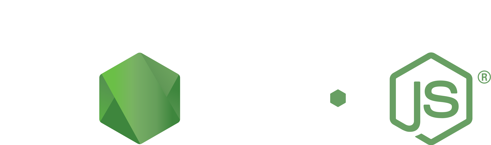

<p align="center">
   
</p>

This API provides a backend for managing fragrances and orders, specifically integrated with the Monday.com platform. It handles CRUD operations, synchronization with Monday.com boards, and processing of webhooks triggered by events on the Monday.com interface.

<hr>

## Table of Contents

- [Installation](#installation)
- [Configuration](#configuration)
- [Usage](#usage)
- [API Endpoints](#api-endpoints)
- [Webhook Handlers](#webhook-handlers)
- [Running the Server](#running-the-server)
- [Application Flow](#application-flow)

## Installation

To set up the project locally, follow these steps:

1. **Clone the repository**:
    ```bash
    git clone https://github.com/mfiloramo/mondayProjectAPI.git
    cd mondayProjectAPI
    ```

2. **Install dependencies**:
    ```bash
    npm install
    ```

3. **Set up environment variables**: Create a `.env` file (or obtain one from the project owner) in the root directory with the following variables:
    ```env
    DB_NAME=your_database_name
    DB_USER=your_database_user
    DB_PASS=your_database_password
    DB_HOST=your_database_host
    MONDAY_API_TOKEN=your_monday_api_token
    BOARD_ID_FRAGRANCES=your_fragrances_board_id
    BOARD_ID_ORDERS=your_orders_board_id
    PORT=your_server_port
    ```

## Configuration

The Sequelize configuration is used to connect to a Microsoft SQL Server database. Here is the setup for the `sequelize` instance:

```javascript
import { Sequelize as SequelizeInstance } from 'sequelize';
import dotenv from 'dotenv';

dotenv.config();

const DB_NAME = process.env.DB_NAME;
const DB_USER = process.env.DB_USER;
const DB_HOST = process.env.DB_HOST;
const DB_PASS = process.env.DB_PASS;

const options = {
  host: DB_HOST,
  dialect: 'mssql',
  pool: {
    max: 5,
    min: 0,
    acquire: 30000,
    idle: 10000
  }
};

const sequelize = new SequelizeInstance(DB_NAME, DB_USER, DB_PASS, options);

export { sequelize };
```

## Usage

The API provides endpoints for managing fragrances and orders, integrating with Monday.com boards, and handling webhooks (triggered within monday.com) for automatic updates.

### API Endpoints

#### Fragrances

- **GET `/api/fragrances`**: Retrieve all fragrances.
- **POST `/api/fragrances`**: Add a new fragrance.
- **PUT `/api/fragrances/:id`**: Update an existing fragrance.
- **POST `/api/fragrances/webhook`**: Handle webhooks from Monday.com for fragrances (including fragrance deletion).

#### Orders

- **GET `/api/orders`**: Retrieve all orders.
- **POST `/api/orders`**: Create a new order.
- **PUT `/api/orders/status`**: Update the status of an order.
- **POST `/api/orders/webhook`**: Handle webhooks from Monday.com for orders.

### Webhook Handlers

The API includes webhook handlers to process events from Monday.com boards:

#### Fragrance Webhooks

- `create_pulse`: Adds a new fragrance.
- `update_column_value`: Updates an existing fragrance.
- `delete_pulse`: Deletes a fragrance.

#### Order Webhooks

- `item_created`: Creates a new order.
- `update_column_value`: Updates the status of an order.
- `item_deleted`: Handles deletion of an order (currently a placeholder).

### Running the Server

First, compile the TypeScript code to JavaScript using the following command:
```bash
tsc
```
The compiled code will be outputted to the `dist` directory in the application root. Now, you can run the server:

```bash
npm start
```
This will start the server on the port specified in the `.env` file. The server will listen for incoming API requests and process webhooks from Monday.com.

For running the server in development, use the following command:
```bash
npm run dev
```
This command leverages both `ts-node` and `nodemon` to listen for changes within the application files. Once triggered, it will automatically transpile the TypeScript to JavaScript and restart the Node.js server.

## Deployment

This project is deployed on Heroku, leveraging its platform for reliable and user-friendly application hosting.

### Automated CI/CD Pipeline

Heroku provides an automated CI/CD pipeline that ensures seamless deployment with every push to the `main` branch. This setup automates the build, test, and deployment processes, reducing manual intervention and potential errors. Heroku automatically detects the necessary buildpacks for Node.js projects, sets up the environment, and runs the build process.

## Tech Stack

This project utilizes a modern tech stack to ensure both robustness and ease of development. Below is a brief overview of the technologies used and why they were chosen.

<table style="border-collapse: collapse; border: none;">
  <tr>
    <td style="padding: 10px;">
      <br>
      A statically typed superset of JavaScript that enhances code quality and readability. Chosen for its robust type-checking and improved developer productivity.
    </td>
    <td style="padding: 10px;">
      <br>
      A TypeScript execution engine for Node.js. Chosen for its seamless integration, allowing on-the-fly TypeScript compilation and execution.
    </td>
  </tr>
  <tr>
    <td style="padding: 10px;">
      <br>
      A powerful JavaScript runtime for building scalable applications. Chosen for its performance and asynchronous capabilities.
    </td>
    <td style="padding: 10px;">
      <br>
      A minimal web framework for Node.js. Chosen for its simplicity and robust feature set for building APIs.
    </td>
  </tr>
  <tr>
    <td style="padding: 10px;">
      <br>
      A promise-based ORM for SQL databases. Chosen for its ease of use and support for various SQL databases.
    </td>
    <td style="padding: 10px;">
      <br>
      A reliable relational database management system. Chosen for its robust support for complex queries and stored procedures.
    </td>
  </tr>
  <tr>
    <td style="padding: 10px;">
      <br>
      A promise-based HTTP client. Chosen for its simplicity in making HTTP requests to external services like the Monday.com API.
    </td>
    <td style="padding: 10px;">
      <br>
      Tools to integrate with the Monday.com platform. Chosen for seamless integration and synchronization with Monday.com boards.
    </td>
  </tr>
</table>


## Application Flow
Below is a diagram illustrating the flow of data within the API. Data flows from the server to the API, which processes requests by firing stored procedures that interact with the database, and updates are synchronized with Monday.com via webhooks.

<p align="center">
   
</p>
<br><br>
